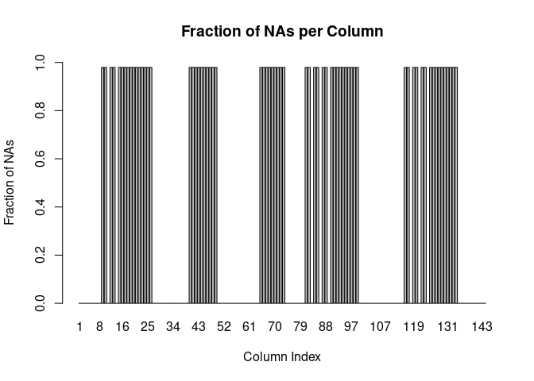

R Markdown
----------

This is code and documentation for the Coursera Data Science machine
learning project. The goal of the project is to use sensor data to train
a classifier to distinguish between different exercises that were
performed. To accomplish this, the data sets were downloaded and input
into data frames.

``` r
trainingURL <- "https://d396qusza40orc.cloudfront.net/predmachlearn/pml-training.csv"
testingURL  <- "https://d396qusza40orc.cloudfront.net/predmachlearn/pml-testing.csv"
training <- read.csv(trainingURL)
testing  <- read.csv(testingURL)
```

Data Assessment
---------------

The data sets start with 160 columns or variables, in which many are
either unrelated to solving the classification problem or are
uninformative. Let’s start by looking at part of the data summary:

``` r
summary(training[,1:16])
```

    ##        X            user_name    raw_timestamp_part_1 raw_timestamp_part_2
    ##  Min.   :    1   adelmo  :3892   Min.   :1.322e+09    Min.   :   294      
    ##  1st Qu.: 4906   carlitos:3112   1st Qu.:1.323e+09    1st Qu.:252912      
    ##  Median : 9812   charles :3536   Median :1.323e+09    Median :496380      
    ##  Mean   : 9812   eurico  :3070   Mean   :1.323e+09    Mean   :500656      
    ##  3rd Qu.:14717   jeremy  :3402   3rd Qu.:1.323e+09    3rd Qu.:751891      
    ##  Max.   :19622   pedro   :2610   Max.   :1.323e+09    Max.   :998801      
    ##                                                                           
    ##           cvtd_timestamp  new_window    num_window      roll_belt     
    ##  28/11/2011 14:14: 1498   no :19216   Min.   :  1.0   Min.   :-28.90  
    ##  05/12/2011 11:24: 1497   yes:  406   1st Qu.:222.0   1st Qu.:  1.10  
    ##  30/11/2011 17:11: 1440               Median :424.0   Median :113.00  
    ##  05/12/2011 11:25: 1425               Mean   :430.6   Mean   : 64.41  
    ##  02/12/2011 14:57: 1380               3rd Qu.:644.0   3rd Qu.:123.00  
    ##  02/12/2011 13:34: 1375               Max.   :864.0   Max.   :162.00  
    ##  (Other)         :11007                                               
    ##    pitch_belt          yaw_belt       total_accel_belt kurtosis_roll_belt
    ##  Min.   :-55.8000   Min.   :-180.00   Min.   : 0.00             :19216   
    ##  1st Qu.:  1.7600   1st Qu.: -88.30   1st Qu.: 3.00    #DIV/0!  :   10   
    ##  Median :  5.2800   Median : -13.00   Median :17.00    -1.908453:    2   
    ##  Mean   :  0.3053   Mean   : -11.21   Mean   :11.31    -0.016850:    1   
    ##  3rd Qu.: 14.9000   3rd Qu.:  12.90   3rd Qu.:18.00    -0.021024:    1   
    ##  Max.   : 60.3000   Max.   : 179.00   Max.   :29.00    -0.025513:    1   
    ##                                                        (Other)  :  391   
    ##  kurtosis_picth_belt kurtosis_yaw_belt skewness_roll_belt
    ##           :19216            :19216              :19216   
    ##  #DIV/0!  :   32     #DIV/0!:  406     #DIV/0!  :    9   
    ##  47.000000:    4                       0.000000 :    4   
    ##  -0.150950:    3                       0.422463 :    2   
    ##  -0.684748:    3                       -0.003095:    1   
    ##  -1.750749:    3                       -0.010002:    1   
    ##  (Other)  :  361                       (Other)  :  389   
    ##  skewness_roll_belt.1
    ##           :19216     
    ##  #DIV/0!  :   32     
    ##  0.000000 :    4     
    ##  -2.156553:    3     
    ##  -3.072669:    3     
    ##  -6.324555:    3     
    ##  (Other)  :  361

If we look at the first eight columns, we can see values that should be
irrelevant to identifying the activity such as user\_name, timestamps,
and information on the data window. We can also see that some of
variables contain mostly \#DIV/0! or NA values, which we must remove
from consideration.

Data Cleaning
-------------

To deal with these irrelevant variables, we remove them from the
training and testing data sets. Some columns removed were identified as
useless for classification based on the summary (mostly \#DIV/0! values)
and some by their lack of relevancy to the classification problem.

``` r
# ID no information columns
useless_cols <- c("X", "user_name", "raw_timestamp_part_1", 
    "raw_timestamp_part_2","cvtd_timestamp","new_window", "num_window", 
    "kurtosis_yaw_belt", "skewness_yaw_belt", "amplitude_yaw_belt", 
    "kurtosis_yaw_dumbbell", "skewness_yaw_dumbbell", "amplitude_yaw_dumbbell",
    "kurtosis_yaw_forearm", "skewness_yaw_forearm", "amplitude_yaw_forearm")          
training <- select(training, -useless_cols)         # remove those columns
testing  <- select(testing, -useless_cols)
```

The columns with high proportions of NA values can be identified by
determining what fraction of the values are NA.

``` r
library(ggplot2)

# compute the fraction of NAs per column
vals <- sapply(names(training), function(Col){mean(sapply(training[,Col], is.na))})
barplot(vals, names.arg=1:length(vals), xlab="Column Index", 
        ylab="Fraction of NAs", ylim=c(0,1), main="Fraction of NAs per Column")
```



As can be seen, some of the variables hold values that are almost 98%
NAs! We identified and dropped those columns where the fraction of NA
values exceeded 90%. The data in the training and test sets were then
converted to a data matrix to make all values numeric (ensuring that
training and testing columns are the same type), and then converted back
to data frames.

``` r
numericize <- function(df) {  # convert data frame to data matrix and back.
  df <- data.matrix(df)       # forces all values to be numeric type
  data.frame(df)
}

classe <- training$classe          # save the classe values
training <- numericize(training)   # make all training columns numeric values 
testing <- numericize(testing)     # make all testing columns numeric values

clean_nas <- function(Data){  # identify all columns that are not all NAs
  nas <- sapply(names(Data), function(Col){mean(sapply(Data[,Col], is.na))})
  names(nas[nas<0.9])        # return the names of the lower NA columns
}

lenNames <- length(names(testing))         # get # of testing columns
keep <- clean_nas(testing[,-lenNames])     # get cols in testing w/ fewer NAs
training <- training[,keep]                # Drop high NA columns from testing
testing <- testing[,keep]                  # Drop high NA cols in training
```

Data Preprocessing
------------------

With the non-useful variables removed, we still have 52 columns in the
data sets. To reduce the dimensionality of the data sets further, we
apply PCA. By default, the PCA routine in caret only retains enough
columns to explain 95% of the observed variance.

``` r
library(caret)
preObj <- preProcess(training[,-53], method=c("center","scale"))
scaled_train <- predict(preObj, training[,-53])
scaled_test <- predict(preObj, testing)

preProc <- preProcess(scaled_train, method="pca")
pca_train <- predict(preProc, scaled_train)
pca_test <- predict(preProc, scaled_test)
```

Classification
==============

With the data cleaned and dimensionality reduced to 25, we then moved on
to the classification problem. We applied a Random Forest classifier,
using 5-fold cross-validation in the training data to reduce bias in the
classifier outputs. Training was done in parallel to reduce processing
time.

``` r
library(parallel)
library(doParallel)

set.seed(314159)
cluster <- makeCluster(5)
registerDoParallel(cluster)

Cols <- names(pca_train)
tControl <- trainControl(method = "cv",
                           number = 5,
                           allowParallel = TRUE)

modfit <- train(pca_train, classe, method='rf', na.action = na.omit, 
                       proxy=TRUE, trControl = tControl)

stopCluster(cluster)
registerDoSEQ()
modfit
```

    ## Random Forest 
    ## 
    ## 19622 samples
    ##    25 predictor
    ##     5 classes: 'A', 'B', 'C', 'D', 'E' 
    ## 
    ## No pre-processing
    ## Resampling: Cross-Validated (5 fold) 
    ## Summary of sample sizes: 15698, 15697, 15698, 15696, 15699 
    ## Resampling results across tuning parameters:
    ## 
    ##   mtry  Accuracy   Kappa    
    ##    2    0.9802773  0.9750484
    ##   13    0.9754867  0.9689883
    ##   25    0.9668226  0.9580330
    ## 
    ## Accuracy was used to select the optimal model using the largest value.
    ## The final value used for the model was mtry = 2.

Given that the classifier was able to correctly identify 98% of the
correct classes in the training data, I expect that the accuracy on the
testing data should be above 90%

Results
-------

We can test the accuracy of the classifier on the training data, to see
how well it trained:

``` r
table(classe, predict(modfit, pca_train))
```

    ##       
    ## classe    A    B    C    D    E
    ##      A 5580    0    0    0    0
    ##      B    0 3797    0    0    0
    ##      C    0    0 3422    0    0
    ##      D    0    0    0 3216    0
    ##      E    0    0    0    0 3607

So far, so good. Let’s check the classifier’s predictions on the test
data:

``` r
predict(modfit, pca_test)
```

    ##  [1] B A A A A E D B A A B C B A E E A B B B
    ## Levels: A B C D E

These are my predictions for the test data set. We’ll see how accurate
they were after the project is submitted.
